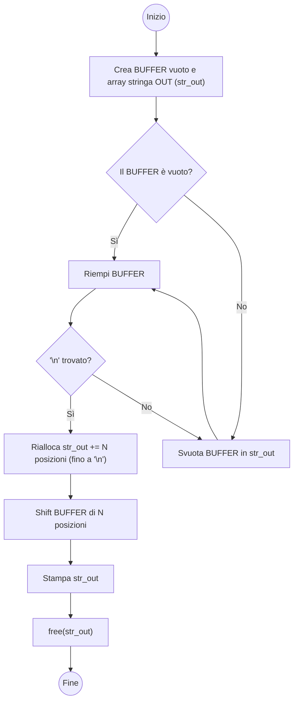

# get_next_line - Bonus track

## Introduzione

L'obiettivo della funzione e’ quello di leggere una linea da un file descriptor identificato e memorizzarla in una stringa. Il separatore per dichiarare la fine della stringa e’ `‘\n’` (newline).

a parte `malloc` e `free` la funzione principale utilizzata e:

```c
ssize_t read(int fd, void buffer_size[.count] size_t byte2read)
```

`read` ha i seguenti parametri

- `fd`: il file descriptor

- `buffer_size[.count]`: la dimensione del buffer. E’ un vettore di lunghezza >= count

- `byte2read`: il numero di byte da leggere (<= `buffer_size`, altrimenti vado in overflow)

come ritorno read mi dice quanti byte ha letto. il numero di byte letti sara’ <= `buffer_size` in quanto puo’ essere che sono arrivato alla fine del file puntato da `fd`.

Return VALUE → `ssize_t`: vuol dire che e’ un `size_t` con segno (*signed size_t*). 

Questo perche’ la funzione potrebbe restituire `-1` in caso di errore. Se la funzione restituisce errore possiamo capirne la causa in quanto viene restituito anche il motivo attraverso `errno`. 

Da tener presente che ad ogni chiamata di read automaticamente il puntatore del file viene aggiornato e quindi si riprende a leggere da dove si era finito.

**NB**: `errno` e’ una variabile “di sistema” che tiene traccia dell’ultimo errore riportato.

Detto in parole povere: ho un file che posso vedere come una sequenza di celle (byte). tramite read leggo un numero di celle (byte2read) e le memorizzo in memoria a partire dalla posizione puntata da buffer_size. Tutte le volte che richiamo read parto a rileggere il file dal punto dove mi ero fermato in precedenza. Automaticamente read memorizza la posizione del puntatore dove ero arrivato.

PS: il buffer NON e’ detto che sia un vettore statico. Potrebbe anche essere allocato dinamicamente

## Come fare il programma???

Secondo me ci sono 2 modi su cui si puo’ operare per avere in ritorno una stringa.

1. utilizzando le liste. Il contenuto di ogni nodo della lista sara’ composto dal buffer. L’ultimo nodo si crea quando ho trovato ‘\n’ nel buffer. La stringa finale sara’ la concatenazione di tutti i nodi. 

2. utilizzando un sistema per riallocare la memoria. Creo un vettore di dimensione almeno quanto il buffer. mano a mano che non trovo `‘\n’` aggiungo memoria.

| Caratteristica                         | realloc con array                                            | Lista concatenata                            |
| -------------------------------------- | ------------------------------------------------------------ | -------------------------------------------- |
| Semplicità                             | Più semplice da implementare                                 | Più complesso da gestire                     |
| Performance di accesso                 | Accesso rapido ai caratteri                                  | Accesso lento (devi percorrere la lista)     |
| Gestione della memoria                 | Rischio di frammentazione, gestione di realloc               | Memoria non contigua, più flessibile         |
| Operazioni di inserimento/eliminazione | Non ideale (potresti dover riposizionare l'intero buffer)    | Ottimale (facile inserire o rimuovere righe) |
| Efficienza di memoria                  | Potrebbe richiedere più ridimensionamenti e memoria contigua | Maggiore overhead (puntatori per ogni nodo)  |

Per quanto mi riguarda ho celto di usare un approccio con array. Implementando direttamente la versione con il bonus ed essendo la parte mandatoria inclusa nel bonus stesso, entrambe le versioni sono uguali (cambiano solo i nomi dei files come richiesto da subject).



## Implementazione

### [get_next_line_bonus.c](get_next_line_bonus.c)

Il codice funziona in questo modo: è creata una struttura composta da 3 campi ([get_next_line.h](get_next_line.h)). Nello specifico:

1. campo fd

2. campo buffer

3. campo bytes letti

viene realizzato un vettore di strutture in maniera statica che associerà ad ogni fd il corrispettivo buffer, così che possa essere recuperato tra le varie chiamate alla funzione.

```c
char	*get_next_line(int fd) \\entry point
```

- Controllo se ad un dato `fd` corrispondono i dati nella struttura corrispondente. In caso non ci fossero alloco dinamicamente un buffer di dimensione `BUFFER_SIZE` e lo inizializzo a `0` (`ft_memset`)

- creo una stringa di dimensione 1 con valore `‘\0’ `che sarà la mia variabile di output (`read_line`)
  inizio un ciclo chiamando, la funzione `run_char_search`, finchè non viene trovato il carattere `‘\n’` oppure finchè non trovo **EOF**. viene utilizzata una variabile di stato (`finish`); finchè tale variabile è **= 0** continuo a iterare.

```c
int	run_char_search(t_buffer_fd *buffer_fd, char **str_out, char separator)
```

Questa funzione restituisce un intero che può valere `0` (carattere separatore non trovato), `1` (carattere separatore trovato) o `-1` (EOF o errori di lettura file in generale). In input accetta:

- puntatore a struttura `t_buffer_fd`

- doppio puntatore alla stringa di out - `**str_out` - (doppio perchè devo andare a modificare l’indirizzo di memoria puntato dalla stringa e quindi lo devo passare per riferimento e non per valore)

- carattere separatore ('\n' ma potrebbe anche esserne un altro se compilo con `-D SEPARATOR='c'`). Non sarebbe stato necessario ma volevo fare una funzione abbastanza flessibile da poter utilizzare altri caratteri.

Il funzionamento è semplice:

- controllo se il buffer è vuoto. in caso lo fosse lo riempio chiamando la funzione `read`

- itero il buffer finchè il mio contatore non è < dei bytes letti. se dovessi trovare il carattere separatore mi fermo e tengo traccia del byte, all'interno del BUFFER, dove sono arrivato e imposto il flag di ritorno (`flg_finish`) a **1**. Se non dovessi trovare il separatore allora arrivo alla fine del buffer ed il flag di ritorno rimarra' a **0**.

- chiamo la funzione `copy_buffer` che copia il numero di bytes passategli in `str_out`. Se non ho trovato il carattere separatore vuol dire che ho svuotato il buffer, copiandolo nella stringa di out, e sono pronto a fare un’altra iterazione su un nuovo buffer, finchè non ho trovato il carattere separatore o trovato **EOF**.

```c
void	copy_buffer(char *buffer, char **str_out, ssize_t bytes, ssize_t bytes_read)
```

Questa funzione non fa altro che copiare `bytes` di `buffer` in una stringa (`str_out`). accetta quindi i seguenti input:

- `buffer` --> il buffer da copiare

- `**str_out` --> la stringa su cui copiarlo (doppio puntatore alla stringa di out (doppio perchè devo andare a modificare l’indirizzo di memoria puntato dalla stringa e quindi lo devo passare per riferimento e non per valore)

- `bytes` --> il numero di bytes da copiare

- `bytes_read` --> il numero di bytes letti

inizialmente fa un controllo che i `bytes` da copiare siano <= `bytes_read`, in caso contrario satura i bytes da copiare ai bytes letti. In caso ci fossero bytes da copiare e il buffer non sia vuoto (controllo solo il primo byte) allora vengono eseguite le seguenti operazioni:

- calcolo lunghezza stringa di out attuale (`ft_strlen`)

- ridimensiono la stringa ottenendo una lunghezza pari a quella attuale + bytes (`ft_realloc`). nel ridimensionamento ovviamente copio i dati presenti al momento dell’operazione. il resto dei dati vengono messi a 0. In caso la stringa fosse più corta questa verrebbe troncata. In realtà per come è pensato il programma (partendo sempre da una stringa di lunghezza 0) non è possibile trovarsi in una condizione di rimpicciolimento. La stringa di OUT aumenterà sempre.

- a partire dalla fine della stringa riempio i bytes rimanenti con quelli del buffer (`ft_memmove`)

- shifto il buffer dei bytes copiati, i restanti bytes vengono messi a 0. Fondamentalmente qui svuoto il buffer di n bytes copiati.

## [get_next_line_utils_bonus.c](get_next_line_utils_bonus.c)

```c
/*
ft_memmove: sposta n bytes da una zona di memoria (sorgente) 
    ad un’altra (destinazione)*/
void	*ft_memmove(void *dest, const void *src, size_t n)
/*
ft_memset: imposta n bytes al valore 'c' 
    partendo da una zona di memoria determinata */
void	ft_memset(void *s, int c, size_t n)
/*
ft_strlen: calcola la lunghezza della stringa che gli passo*/
size_t	ft_strlen(const char *str)
/*
ft_realloc: passatogli un array, la sua dimensione, quella nuova 
    e la dimensione degli elementi rialloca la memoria. 
    Facendo questo copia gli attuali elementi presenti nel vettore 
    mettendo a 0 le posizioni aggiuntive (se new_dim > curr_dim) 
    oppure tronca se la dimensione nuova < della vecchia.*/
void	*ft_realloc(void *array, size_t curr_dim, size_t new_dim,
			size_t elem_dim)
/*
buffer_shift: passatogli un buffer ed un numero di bytes 
    svuota il buffer del dato numero di bytes impostando a 0 i rimanenti
    lasciati liberi. Accetta come parametri il buffer e il numero di bytes
    presupone che ci sia una define BUFFER_SIZE perchè 
    se bytes richiesti >= BUFFER_SIZE deve solo svuotare tutto il buffer*/
void	buffer_shift(void *buffer, ssize_t bytes)
```

# Ti è piaciuto il progetto e ti è stato utile? 🌟 : 💔
